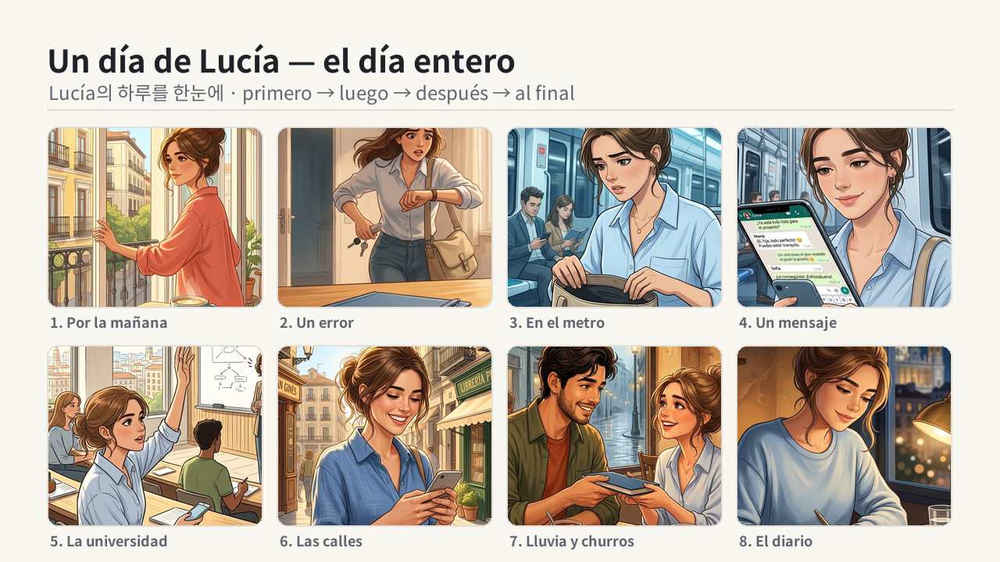

# Diary v2 — Preview Quality Improvement Plan (historia-a1 Ep.1)

Companion to [format-mini-story-spec.md](format-mini-story-spec.md) and
[diary-asset-sourcing.md](diary-asset-sourcing.md). Defines the production-quality
upgrades for `output/preview.mp4` of "Un día de Lucía en Madrid" and exactly where
each change lands in the render pipeline.

> **Status — PLAN ONLY.** Owner decision (2026-05-30): organize as a spec, do **not**
> modify the render pipeline yet. Finale style **locked: static 4×2 grid** (see §4) —
> "locked" fixes the design direction, not the build (T5 still implements it).
> Reviewed with the `/plan-design-review` rubric (0–10 dimension scoring), grounded in
> real extracted frames + measured audio rather than generated web mockups (the skill's
> web-mockup/plan-file machinery does not apply to a video). Filter units below verified
> against the local ffmpeg build (2026-05-30).

## 0. Owner asks

1. **BGM clearly louder** ("30% 이상").
2. **SFX + overall visual design more sophisticated.**
3. **Finale that gathers all 8 scene images on screen at once** → locked to a static grid.

## 1. Measured current state (2026-05-30)

`output/preview.mp4` — 1280×720, 12 fps preview, 409.75 s, AAC 192 kbps.

### Design scorecard (review rubric)

| # | Dimension | Now | Evidence | What a 10 looks like |
|---|---|:--:|---|---|
| 1 | Information hierarchy | 5 | Caption panel is the eye's first stop; illustration (the emotional anchor) is covered; KO subtitle is 24px thin muted gray = weakest element, yet it is the comprehension anchor for a Korean audience | Art breathes; ES = primary text; KO = clearly readable secondary; order-words (primero/luego/después/al final) emphasized |
| 2 | Transitions / composition | 6 | Hard cut between every segment; no finale; no end-card | 0.4 s dissolves, recap montage, next-episode CTA |
| 3 | Storytelling / emotional arc | 6 | Story is warm but intro/outro are flat and the ending has no visual payoff | Intro sets mood, transitions keep flow, montage delivers the "you followed the whole day" button |
| 4 | Specificity / anti-slop | 5 | Flat cream "default-slide" intro/outro + solid-color scene cards = the video equivalent of AI slop | Intentional typography, scene art behind headers, designed caption treatment |
| 5 | Design-system consistency | 6 | Color blocks + Noto Sans are consistent, but generic *Für Elise* piano is used while on-brand BGM drafts exist | Unified motion language, on-brand audio |
| 6 | Legibility / resolution | 5 | 720p output though sources are 1920×1080; captions cover the subject | 1080p, captions clear of subjects, mobile-legible type |
| 7 | **Audio mastering** | 3 | **Integrated −27.8 LUFS, true peak −12.3 dBTP** (measured) vs YouTube reference −14 LUFS | −14 LUFS master, BGM present under narration |

**Overall ~5/10 → target ~9/10.** Illustration assets themselves are ~8/10 (warm,
character-consistent); nearly all the gap is in the presentation layer.

### Asset reality (updates [diary-asset-sourcing.md](diary-asset-sourcing.md) §1)

- **Images — RESOLVED.** `assets/story/*.png` (×8) are now real **1920×1080 PNG**
  (the asset-sourcing §1 "1024² JPEG" row is stale — corrected in that doc). `make check`
  image warnings: **0**.
- **SFX — still placeholder.** `assets/audio/sfx/*.wav` (×15) are all **88244 bytes,
  byte-identical** = one silent stub copied 15×. Still surfaces as ~16 SFX warnings.

## 2. Audio — make BGM clearly louder (ask #1)

**The +2.3 dB base bump already applied (`bgm_volume_db −20 → −17.7`) is mostly
swallowed.** Two upstream effects dominate:

1. **`amix` halves everything.** [build/audio.py:496](../../build/audio.py) (and the
   no-duck branch at :503) uses `amix=inputs=2` with the default `normalize=1`, which
   scales each input by 1/n (≈ −6 dB). That is why even 0 dB narration peaks at only
   −12.3 dBTP and the whole mix sits at −27.8 LUFS.
2. **Ducking crushes the BGM.** `ducking_ratio=16` + `ducking_threshold=0.025`
   ([historia AUDIO:729-732](../../projects/historia_a1_un_dia_de_lucia.py)) is near-limiting.
   Narration runs almost continuously for ~6 min, so BGM only resurfaces in the 2 s
   pauses and scene gaps. **Perceived "BGM is quiet" is governed by ducking, not base dB.**

### Changes (when implemented)

**Signal chain (order matters):** narration+SFX → `amix(normalize=0)` with BGM → safety
limiter → `loudnorm` master.

- [build/audio.py](../../build/audio.py) `mix_with_bgm`, both filter branches: set
  `amix=...:normalize=0` so inputs are summed, not each scaled by 1/n (−6 dB).
- **Clipping safety (important — raised in review).** With `normalize=0`, narration near
  0 dBFS summed with BGM can exceed 0 dBFS. The filtergraph runs in float (`fltp`) so there
  is no hard clip *inside* the graph, and `loudnorm` carries its own true-peak limiter
  (`TP`) that caps the final output — but make the protection explicit so a future reorder
  can't introduce distortion. Pick one:
  - Insert `alimiter=level_in=1:level_out=1:limit=0.9` between `amix` and `loudnorm`.
    **`limit` is linear amplitude (range 0.0625–1), not dB** — `0.9 ≈ −0.9 dBFS` (verified
    against the local ffmpeg build). **or**
  - Pre-attenuate the narration leg by `volume=-3dB` before the sum to reserve headroom,
    then let the master make it back up.
- **Master stage** after the limiter: single-pass `loudnorm=I=-14:TP=-1.5:LRA=11`
  (YouTube reference). Upgrade path = two-pass loudnorm (analyze, then apply) for tighter
  accuracy. Net effect ≈ +13 dB with controlled peaks, not clipping.
- [historia AUDIO ducking](../../projects/historia_a1_un_dia_de_lucia.py): `ducking_ratio
  16 → 4`. `ducking_threshold 0.025 → ~0.05` — **this threshold is linear amplitude in
  ffmpeg `sidechaincompress` (range 0.00098–1, default 0.125), NOT dB**: `0.025 ≈
  −32 dBFS`, `0.05 ≈ −26 dBFS`. Also shorten `ducking_release_ms 900 → ~500-600` so BGM
  recovers between lines, not only in the long 2 s pauses (current attack=80 ms /
  **release=900 ms**). Keep `bgm_volume_db −17.7`; the master stage now sets final loudness.
- Leave SFX at −9.7 dB (the +2.3 dB bump is fine post-master; higher makes them poke
  through the louder bed).

**Verify:** re-render, then
`ffmpeg -i output/preview.mp4 -af loudnorm=print_format=summary -f null -`. This is a
single-pass *analysis* of the mastered file, so read the reported **`Input Integrated`**
(= measured loudness of the output) — it should be ≈ −14 LUFS (from −27.8) with
**`Input True Peak`** ≤ −1.5 dBTP. Ear-check on headphones: BGM is present under narration
and **returns to full level within ~1 s pauses** (≥2 s pauses for certain). If it only
resurfaces in the long pauses, shorten `release` further.

## 3. Visual polish (ask #2)

All in [build/render_diary.py](../../build/render_diary.py) unless noted.

| Item | Where | Change | Dim |
|---|---|---|---|
| Caption treatment | `render_diary_caption` [:158-221](../../build/render_diary.py) | Replace near-opaque cream box (alpha 238) with a **bottom gradient scrim** + shorter panel so props (notebook/phone/churros) show; bump KO weight/size and darken it so it stops being a whisper | 1, 6 |
| Scene transitions | `build_diary_video_clip` [:233-365](../../build/render_diary.py) | Hard cuts → **0.4 s crossfades** (moviepy `CrossFadeIn/Out`) on beat/scene boundaries; dip on scene headers | 2, 3 |
| Intro / outro | bg branch [:86-108](../../build/render_diary.py) | Flat cream slide → **scene illustration dimmed behind the title** + subtle motion | 4 |
| Scene header | `render_diary_background` [:110-130](../../build/render_diary.py) | Solid-color card → the scene's own illustration **blurred/dimmed** behind title; animate the underline | 4 |
| Richer Ken Burns | `make_bg_frame` [:334-340](../../build/render_diary.py) | Currently always centered 1.0→1.08 zoom → vary **pan direction + zoom per scene** for variety | 3 |
| 1080p output (optional) | `DESIGN["output_size"]` [historia:104](../../projects/historia_a1_un_dia_de_lucia.py) | `(1280,720) → (1920,1080)`; sources already 1080p (no upscale). **Cost:** the canvas/crop rescale automatically, but font sizes + panel dims are hardcoded for 720p and must be scaled ~1.5× by hand — **full inventory in [Appendix A](#appendix-a--hardcoded-720p-constants-for-the-t8-1080p-migration)** | 6 |

## 4. Finale montage — static 4×2 grid (ask #3, LOCKED)

The text-only outro gets a recap grid of all 8 illustrations: emotional payoff +
review of the day in one frame. Mock built from the **real 8 scene images**:

### Build (when implemented)

- **Segment.** Add a `type:"montage"` segment in `_build_diary_segments`
  ([historia:630-694](../../projects/historia_a1_un_dia_de_lucia.py)), placed with/before the
  outro, with an explicit `duration_s: 6.0`.
- **Render fn.** Add `render_diary_montage(scenes, design)` in
  [build/render_diary.py](../../build/render_diary.py) — reuse the mock layout: cream bg
  `(248,247,242)`, header "Un día de Lucía — el día entero" + KO line + order-word strip,
  **4 cols × 2 rows**, cover-cropped rounded thumbnails (radius 14), scene-number captions.
- **Timeline (specifics, raised in review).** `DiaryTiming` already carries a `type` field
  ([diary_timeline.py:14](../../build/diary_timeline.py)) and `build_diary_timings` is
  type-agnostic — it builds a timing for *every* segment, so a montage segment gets one
  automatically (`scene_id=None`, empty text). In `segment_duration`
  ([:32-72](../../build/diary_timeline.py)) `montage` currently falls through to the default
  `return float(segment.get("duration_s", 0.0))` branch; **add `"montage"` to the explicit
  branch at [:62-67](../../build/diary_timeline.py)** so it is handled deliberately and stays
  TTS-aware if a recap voiceover is added later.
- **Render routing (specifics).** A montage segment has no resolvable `image_path`, so
  `build_diary_video_clip` routes it to the static-`ImageClip` fallback at
  [:343-346](../../build/render_diary.py) that calls `render_diary_background`. **Add a
  `seg_type == "montage"` branch in `render_diary_background`** ([:71-155](../../build/render_diary.py))
  returning `render_diary_montage(...)` — today unknown types hit the bg-color fallback at :155.
- Hold ~5–8 s; reuse as the YouTube end-card backdrop. Regenerate the mock with the same
  parameters if assets change.

## 5. SFX sophistication (part of ask #2 — asset-dependent)

Two tracks:
- **Real assets (out of code scope):** the 15 SFX are byte-identical silent stubs. Source
  distinct CC0 audio per [diary-asset-sourcing.md](diary-asset-sourcing.md) §3.
- **Code-side polish:** in `mix_sfx_layer` ([build/audio.py:308-451](../../build/audio.py)),
  apply fade-in/out **automatically in code** — a default ~30–50 ms fade on every spot SFX
  as its clip is built (so the default path needs no manifest edits), with **optional
  per-item overrides** via new `fade_in_ms` / `fade_out_ms` keys on `SFX_MANIFEST` entries
  for special cases. Add a short crossfade at ambient-bed loop seams, and balance
  ambient-bed ↔ spot levels. Optionally swap BGM to a brand draft
  (`assets/audio/spanish-lab-brand-bgm-*flamenco-tango*.wav`) for a more "designed" feel
  than generic piano.

## 6. Implementation tasks

| ID | P | Task | Files | Verify |
|---|:--:|---|---|---|
| T1 | P1 | amix `normalize=0` + safety limiter (`alimiter limit=0.9`) + `loudnorm I=-14` master | `build/audio.py` | re-measure `Input Integrated` ≈ −14 LUFS, TP ≤ −1.5 dBTP |
| T2 | P1 | Ducking `ratio 16→4`, `threshold 0.025→0.05` (linear), `release 900→~550 ms` | `projects/historia_…py` | BGM returns to full in ~1 s pauses |
| T3 | P1 | Caption: gradient scrim + KO contrast/weight | `build/render_diary.py` | frame check: prop visible, KO legible |
| T4 | P2 | Scene crossfades (0.4 s) | `build/render_diary.py` | no hard cuts on playback |
| T5 | P2 | Finale montage segment + render fn + timeline/routing (static grid) | `historia_…py`, `render_diary.py`, `diary_timeline.py` | montage shows 8 tiles at end |
| T6 | P2 | Intro/outro + scene-header use scene art | `build/render_diary.py` | frame check |
| T7 | P3 | Per-scene Ken Burns pan/zoom variety | `build/render_diary.py` | visual variety |
| T8 | P3 | 1080p output + font/panel rescale (see Appendix A) | `historia_…py`, `render_diary.py` | 1920×1080, type balanced |
| T9 | P3 | SFX envelopes/stereo + brand BGM (after real assets) | `build/audio.py`, `historia_…py` | `make check` SFX warnings →0 |

All P1–P2 must keep `PROJECT=historia_a1_un_dia_de_lucia make test` (47 tests) and
`make check` green (image warnings already 0; SFX warnings remain until T9 assets land).

## 7. Out of scope / deferred

- Real CC0 SFX/ambient + BGM sourcing — owned by [diary-asset-sourcing.md](diary-asset-sourcing.md).
- Animated/Polaroid finale variants — owner chose the static grid.
- Linguist approval of es/ko lines and final 30 fps render/publish (`make render-diary` /
  `publish-diary`) — gated separately by the project STATUS header.

## 8. Verification checklist (post-implementation)

1. `PROJECT=historia_a1_un_dia_de_lucia make preview-diary` rebuilds `output/preview.mp4`.
2. `ffmpeg -i output/preview.mp4 -af loudnorm=print_format=summary -f null -` → reported
   **`Input Integrated`** (measured loudness of the mastered file) ≈ −14 LUFS and
   **`Input True Peak`** ≤ −1.5 dBTP.
3. `make test` (47 pass) and `make check` (0 image warnings) stay green.
4. Spot-check frames: intro/header use art; captions clear the subject; KO legible;
   montage renders all 8 tiles at the end. Ear-check: BGM present under narration and
   recovers in short pauses.

## Appendix A — Hardcoded 720p constants (for the T8 1080p migration)

`output_size_for_design(DESIGN)` ([build/camera.py:15-19](../../build/camera.py)) returns
`DESIGN["output_size"]`; `width`/`height` propagate automatically into
`render_diary_background`, `render_diary_caption`, and `build_diary_video_clip`
(`CompositeVideoClip` size + `crop_and_resize` output_size). So changing `output_size`
rescales the **canvas and the crop** — but the literal pixel offsets and font sizes below
are tuned for 720p and must be scaled ~1.5× by hand. The Ken Burns zoom (`1.0→1.08`) and
`crop_and_resize` are ratio-based and need no change.

| Location | Hardcoded 720p values to rescale |
|---|---|
| `render_diary_caption` [:158-221](../../build/render_diary.py) | panel `1100×210`; bottom margin `40`; corner radius `16`; inner pad `40`; speaker badge h `32` / radius `6` / +20 w; line advance ES `42`, KO `30`; KO baseline `panel_h−60`; fonts speaker `22` / ES `34` / KO `24`; wrap width `panel_w−80` |
| `render_diary_background` intro/outro [:86-108](../../build/render_diary.py) | left bar width `24`; fonts title `48` / sub `24` / body `28`; origins title `(80,100)`, sub `y=165`, rule `y=210`, body `y=250`, line advance `45` |
| `render_diary_background` scene_header [:110-130](../../build/render_diary.py) | fonts `36` / `64` / `36`; y: num `200`, ES `280`, underline `400` (half-width `150`), KO `430` |
| `render_diary_background` diary_line/pause fallback [:132-153](../../build/render_diary.py) | left bar `24`; watermark font `20` at `(60,40)`, rule `y=75`; placeholder font `28` at `y=260` |
